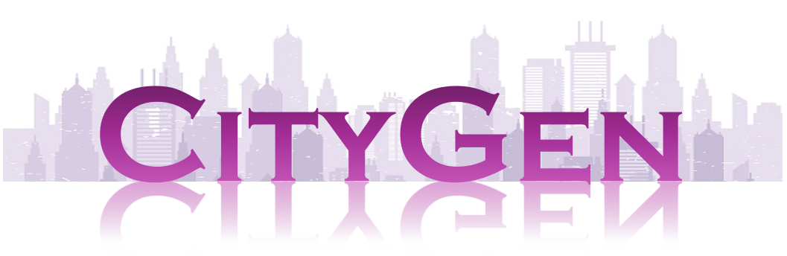

# CityGen: Infinite and Controllable 3D City Layout Generation

[]()

> **CityGen: Infinite and Controllable 3D City Layout Generatiot**  
> Jie Deng<sup>♠️</sup>, Wenhao Chai<sup>♠️♥️</sup>, Jianshu Guo<sup>♠️</sup>, Qixuan Huang, Wenhao Hu, Jenq-Neng Hwang, Gaoang Wang✉️   
> _arXiv 2023._  
> <sup>♠️</sup> Equal contribution. <sup>♥️</sup> Project lead.

CityGen is a novel framework for infinite, controllable and diverse 3D city layout Generation. We propose an auto-regressive out-painting pipeline to extend the local layout to an infinite city layout. Moreover, we utilize a multi-scale diffusion model to generate controllable semantic field.

## :fire: News
* **[TBD]** : We will soon release our code, model weight, and dataset.
* **[2023.12.xx]** :page_with_curl: We release the [paper]().

## 💡 Overview
In the initial step, we sample a local block from noise and extend it infinitely through the auto-regressive outpainting process. Subsequently, we iteratively refine the global semantic field to achieve a more nuanced and polished global field. Following the refinement, height values are assigned to each class. After that, we integrate the semantic field with the height field to synthesize the 3D layout. Finally, by employing an image-to-image approach, we can effectively synthesize diverse city scenes.


## 📣 Case Study
### User control

### 3D layout

### Rendering


## ✏️ Citation

If you find CityGen useful for your your research and applications, please cite using this BibTeX:

```bibtex

```
